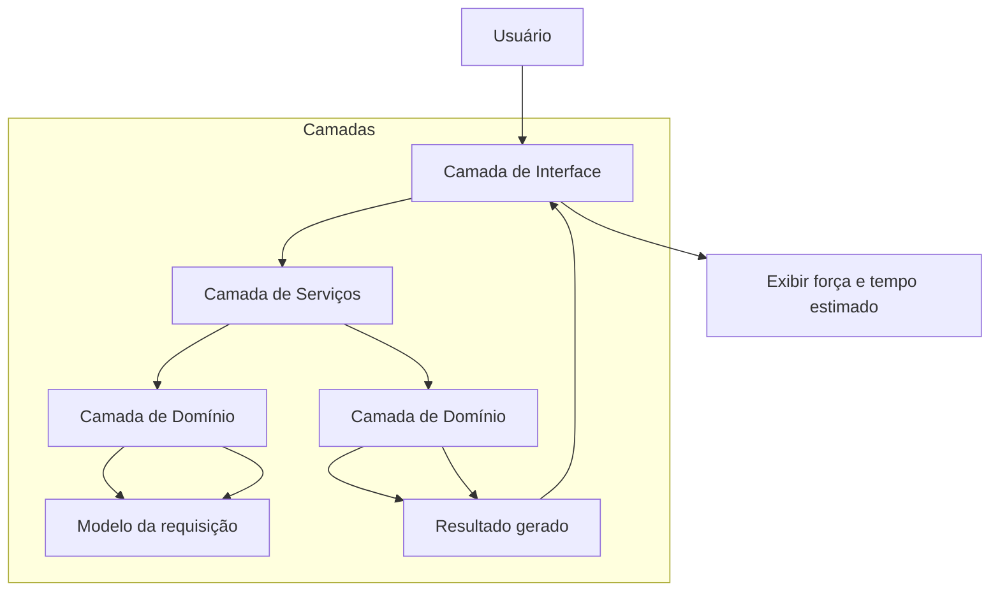

# Arquitetura de Componentes

## Visão geral

A aplicação utiliza uma organização por camadas para separar as preocupações entre interface, serviço e domínio.

## Camadas

### 1. Interface
Responsável por receber entradas do usuário e apresentar a senha gerada.

- formulário com tamanho, chave 1, chave 2 e referência;
- visualização da senha resultante;
- informações sobre força e tempo estimado para quebra.

### 2. Serviços
Responsável por orquestrar a geração e a análise do resultado.

- validação dos dados de entrada;
- criação da requisição de senha;
- execução da lógica central;
- avaliação de força da senha.

### 3. Domínio
Responsável pela regra de negócio principal.

- definição da política de tamanho da senha;
- geração baseada em chave e referência;
- cálculo da entropia e da força;
- geração do resultado final.

## Fluxo principal

1. O usuário informa o tamanho e os campos de entrada.
2. A interface envia esses dados para o serviço.
3. O serviço valida a requisição.
4. O domínio gera a senha conforme a lógica anterior.
5. A interface exibe a senha e os indicadores de segurança.

## Benefícios da arquitetura

- baixo acoplamento entre camadas;
- maior facilidade de manutenção;
- testes mais simples e isolados;
- evolução gradual da aplicação sem quebrar a lógica central.
